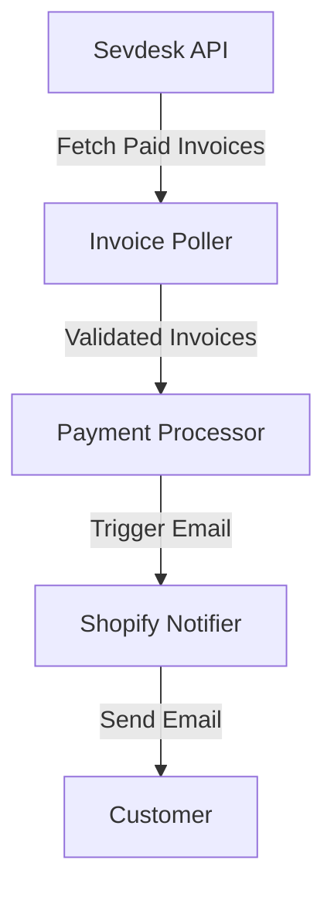

# Architecture

## Overview
The `sevdesk-shopify-connector` facilitates integration between Sevdesk and Shopify by automating payment confirmation workflows. It polls Sevdesk for paid invoices and triggers Shopify to send payment confirmation emails.

### Key Components
- **Invoice Poller**:
  - Periodically fetches paid invoices from Sevdesk using their API.
- **Payment Processor**:
  - Validates invoice data and ensures payment status is confirmed.
- **Shopify Notifier**:
  - Sends payment confirmation emails via Shopify's email service.

## Component Interaction
1. **Invoice Poller** fetches paid invoices from Sevdesk.
2. **Payment Processor** validates and processes the invoices.
3. **Shopify Notifier** triggers Shopify's email service to send payment confirmations.

## Data Flow

## Deployment Considerations
- Ensure API keys for Sevdesk and Shopify are securely stored and rotated periodically.
- Use rate limiting to avoid exceeding API quotas.
- Monitor logs for errors in invoice processing and email notifications.

## Future Improvements
- Add retry mechanisms for failed API calls.
- Enhance logging with structured formats for better debugging.
- Support additional notification channels (e.g., SMS, Slack).