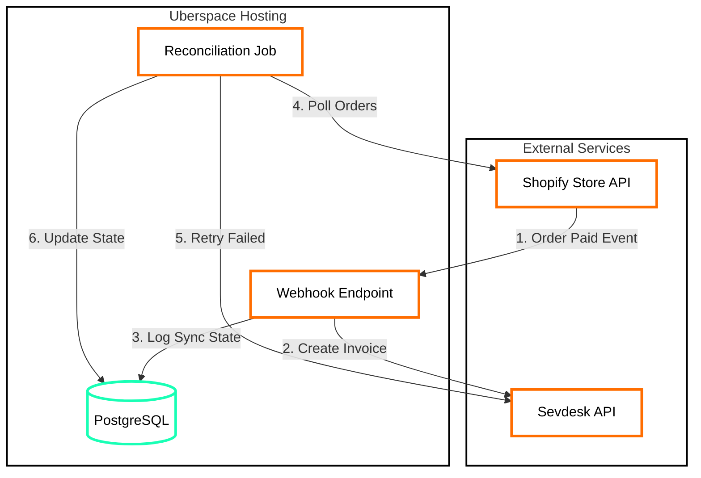
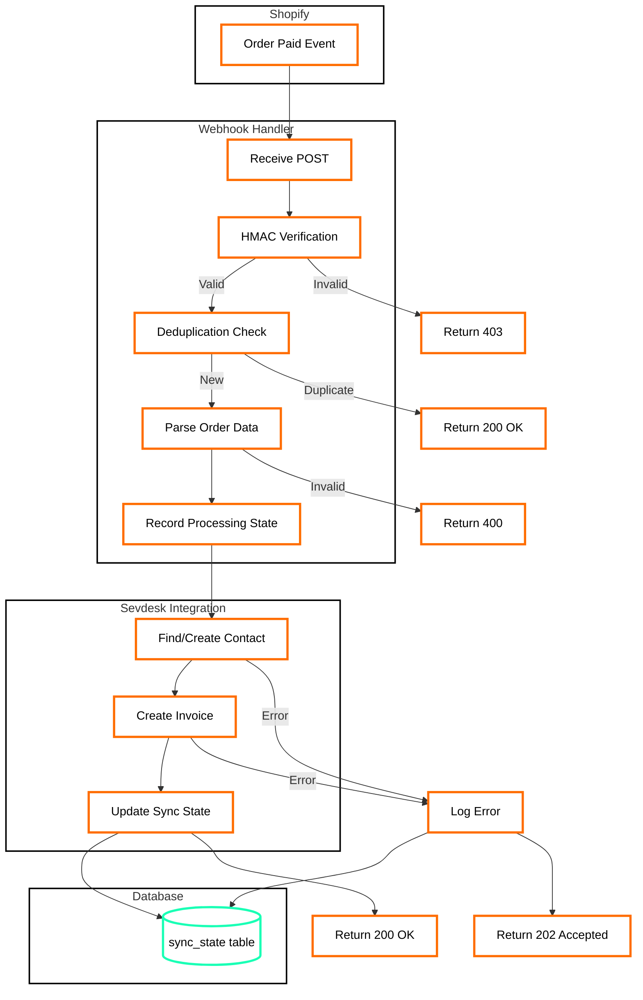
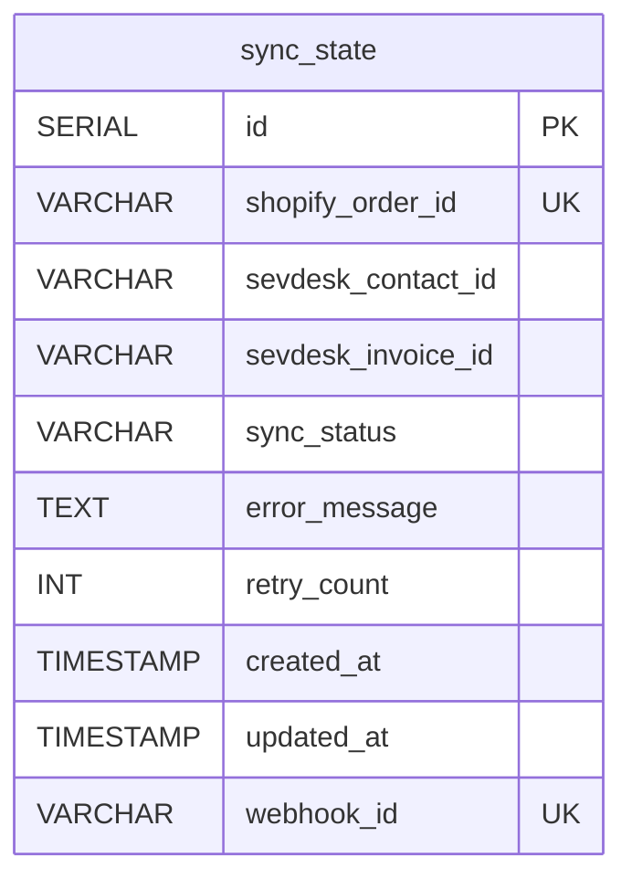
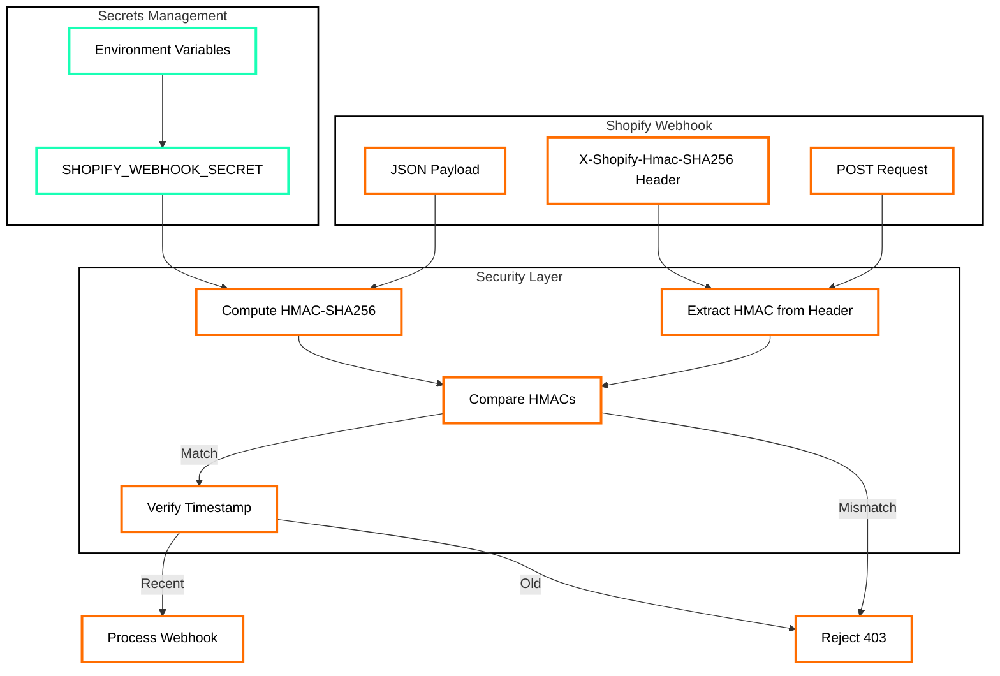
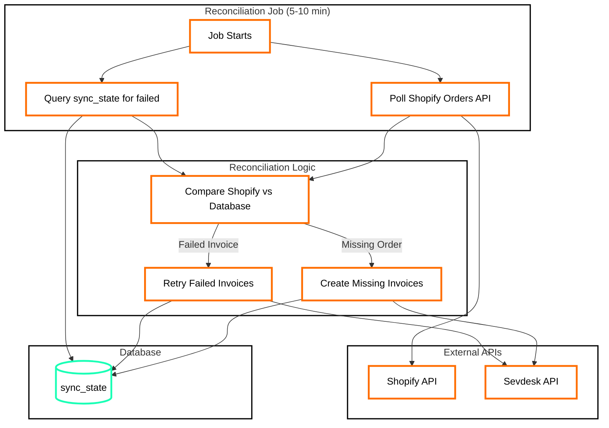
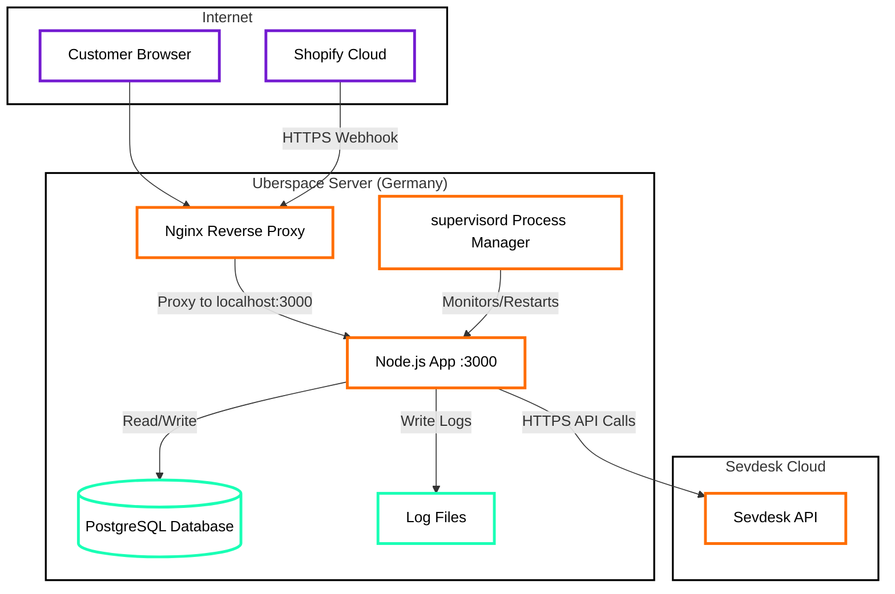

# Architecture Diagrams: Shopify-Sevdesk Connector

Comprehensive visual architecture documentation for the Shopify-Sevdesk integration connector.

## System Overview



The diagram illustrates the core system flow of the **Shopify-Sevdesk Connector**:

- `Shopify Store API`: Triggers order/paid webhook events
- `Webhook Endpoint`: Receives webhooks, creates invoices (real-time)
- `Reconciliation Job`: Polls for missed orders, retries failures (5-10 min cycle)
- `Sevdesk API`: Invoice and contact management
- `PostgreSQL`: Tracks sync state, idempotency, retry counts

---

## Phase 1: Webhook Processing Flow



The diagram illustrates the **Phase 1 Webhook Processing Flow**:

- `HMAC Verification`: Validates webhook authenticity (prevents spoofing)
- `Deduplication Check`: Uses X-Shopify-Webhook-Id to prevent duplicate processing
- `Parse Order Data`: Extracts customer email, line items, total price
- `Find/Create Contact`: Ensures customer exists in Sevdesk
- `Create Invoice`: Creates invoice with line items from order
- `Update Sync State`: Records success/failure in PostgreSQL for reconciliation

**Error Handling**:
- Invalid HMAC → 403 Forbidden (security event logged)
- Duplicate webhook → 200 OK (idempotency)
- Parse error → 400 Bad Request
- Sevdesk API error → 202 Accepted + logged for retry

---

## Database Schema



The **sync_state** table tracks the synchronization status of each order:

- `shopify_order_id`: Unique Shopify order ID (gid://shopify/Order/...)
- `webhook_id`: X-Shopify-Webhook-Id header (idempotency key)
- `sync_status`: `pending`, `processing`, `completed`, `failed`
- `sevdesk_contact_id`: Sevdesk contact ID after customer lookup
- `sevdesk_invoice_id`: Sevdesk invoice ID after creation
- `error_message`: Last error details for debugging
- `retry_count`: Number of retry attempts (max 5)
- `created_at`: When webhook first received
- `updated_at`: Last status change

**Indexes**:
- `idx_sync_status`: Fast filtering by status (reconciliation)
- `idx_updated_at`: Time-based queries (find stale records)

**Unique Constraints**:
- `shopify_order_id`: Prevent duplicate orders
- `webhook_id`: Prevent duplicate webhook processing

---

## Security Architecture



The diagram illustrates the **Security Architecture**:

- `HMAC Verification`: Uses SHA-256 to verify webhook authenticity
- `Secret Management`: Webhook secret stored in environment variables (never hardcoded)
- `Timestamp Verification`: Rejects webhooks older than 5 minutes (prevents replay attacks)
- `Reject 403`: Invalid HMAC triggers security event log

**Security Requirements**:
1. HMAC verification on all webhooks (CRITICAL)
2. Environment variables for secrets (CRITICAL)
3. Timestamp validation (HIGH)
4. No customer emails in logs (HIGH)
5. HTTPS only (CRITICAL on Uberspace)

---

## Phase 2: Reconciliation Flow



The diagram illustrates the **Phase 2 Reconciliation Flow**:

- `Query sync_state`: Find orders with `sync_status = 'failed'` or retry_count > 0
- `Poll Shopify Orders API`: Fetch orders from last 24 hours
- `Compare`: Identify missing orders (webhook missed) or failed invoices
- `Retry Failed Invoices`: Exponential backoff (1 min, 5 min, 30 min, 2 hrs, 12 hrs)
- `Create Missing Invoices`: Handle webhook delivery failures

**Reconciliation Strategy**:
1. Run every 5-10 minutes (cron job)
2. Query `sync_state` for failed records
3. Poll Shopify for recent orders
4. Compare and identify gaps
5. Retry with exponential backoff
6. Update sync_state after each attempt

---

## Deployment Architecture (Uberspace)



The diagram illustrates the **Uberspace Deployment Architecture**:

- `Nginx`: Reverse proxy handling HTTPS termination (Uberspace managed)
- `Node.js App`: Express server listening on localhost:3000
- `supervisord`: Process manager ensuring app runs continuously
- `PostgreSQL`: Database for sync state tracking
- `Log Files`: Structured JSON logs for debugging

**Deployment Requirements**:
1. Uberspace account (EUR 6-9/month)
2. Web backend: `uberspace web backend set / --http --port 3000`
3. Database: `uberspace tools version use postgresql 15`
4. supervisord: Auto-restart on crashes
5. HTTPS: Automatic via Uberspace (Let's Encrypt)

---

## Technology Stack

```mermaid
graph TD
    %% Technology Stack Diagram
    
    subgraph Runtime ["Runtime Environment"]
        Node[Node.js 20.x LTS]
        TS[TypeScript 5.x]
    end
    style Runtime fill:#ffffff,stroke:#000000,stroke-width:2px
    
    subgraph Framework ["Web Framework"]
        Express[Express.js 4.x]
        Middleware[Middleware Stack]
    end
    style Framework fill:#ffffff,stroke:#000000,stroke-width:2px
    
    subgraph Database ["Database Layer"]
        PG[PostgreSQL 15]
        PGClient[node-postgres pg]
    end
    style Database fill:#ffffff,stroke:#000000,stroke-width:2px
    
    subgraph APIs ["External APIs"]
        ShopifySDK[@shopify/shopify-api]
        SevdeskREST[Sevdesk REST API]
    end
    style APIs fill:#ffffff,stroke:#000000,stroke-width:2px
    
    subgraph Testing ["Testing & Quality"]
        Jest[Jest Testing Framework]
        Supertest[Supertest HTTP Testing]
        TSLint[ESLint + TypeScript]
    end
    style Testing fill:#ffffff,stroke:#000000,stroke-width:2px
    
    subgraph Utilities ["Utilities"]
        Dotenv[dotenv Config]
        Winston[Winston Logging]
        Cron[node-cron Scheduling]
    end
    style Utilities fill:#ffffff,stroke:#000000,stroke-width:2px
    
    Node --> TS
    TS --> Express
    Express --> Middleware
    Express --> PGClient
    PGClient --> PG
    Express --> ShopifySDK
    Express --> SevdeskREST
    Express --> Winston
    Middleware --> Winston
    Cron --> Express
    
    %% Testing connections
    Jest --> Express
    Supertest --> Express
    TSLint --> TS
    
    %% Config
    Dotenv --> Node
    
    %% Classes
    class Node,TS software;
    class Express,Middleware software;
    class PG files;
    class PGClient software;
    class ShopifySDK,SevdeskREST software;
    class Jest,Supertest,TSLint software;
    class Dotenv,Winston,Cron software;
    
    %% Class Definitions
    classDef software fill:#ffffff,stroke:#ff6d00,stroke-width:3px,color:#000;
    classDef files fill:#ffffff,stroke:#19ffb5,stroke-width:3px,color:#000;
```

The diagram illustrates the **Technology Stack**:

**Runtime**:
- Node.js 20.x LTS (long-term support)
- TypeScript 5.x (strict mode, type safety)

**Web Framework**:
- Express.js 4.x (minimal, flexible)
- Middleware: HMAC verification, error handling, logging

**Database**:
- PostgreSQL 15 (ACID compliance, JSON support)
- node-postgres (pg) client library

**External APIs**:
- @shopify/shopify-api SDK (webhooks, REST/GraphQL)
- Sevdesk REST API (direct HTTP calls)

**Testing & Quality**:
- Jest (unit + integration tests)
- Supertest (HTTP endpoint testing)
- ESLint + TypeScript (code quality)

**Utilities**:
- dotenv (environment variables)
- Winston (structured logging)
- node-cron (reconciliation scheduling)

---

## Validation Checklist

All diagrams follow Creative Tech standards:

- [x] All subgraphs have white backgrounds (`fill:#ffffff`)
- [x] All nodes use Creative Tech colors (purple/teal/orange borders)
- [x] No yellow backgrounds visible in rendered diagrams
- [x] Subgraph identifiers match style references exactly
- [x] Description paragraphs explain diagram purpose
- [x] Hardware (purple): Customer browsers, Shopify cloud
- [x] Files (teal): Database, logs, config files
- [x] Software (orange): Services, APIs, processors

---

## References

- Technical Specification: `workspace/docs/planning/A1-tech-spec.md`
- Phase 1 Implementation Plan: `workspace/docs/planning/A2-phase1-plan.md`
- Comprehensive Synthesis: `workspace/docs/knowledge/comprehensive-synthesis.md`
- Mermaid Standards: `workspace/docs/global/documentation/mermaid-diagram-standards.md`
