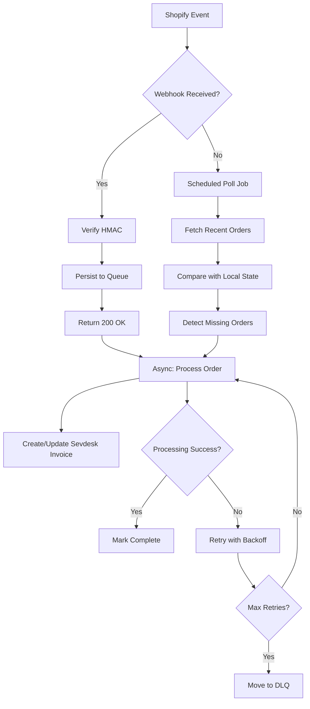
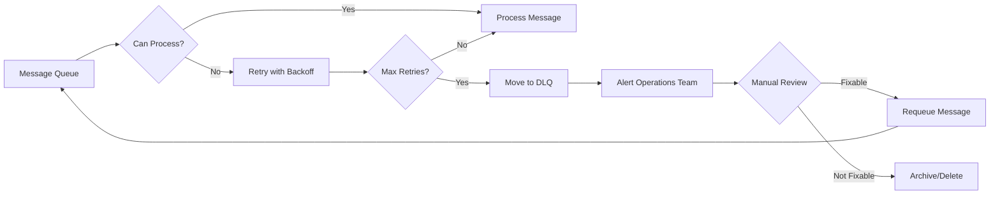
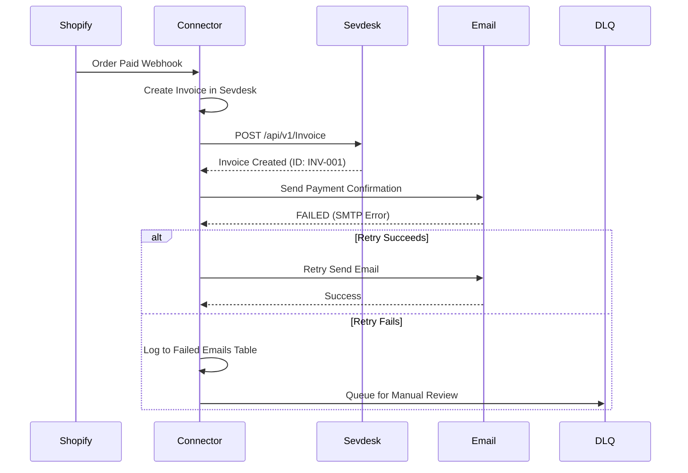

# Integration Patterns: Event-Driven vs Polling Architectures

**Research Task**: R3 - Shopify-Sevdesk Connector  
**Date**: 2026-02-17  
**Depth**: Comprehensive  
**Output**: docs/knowledge/technical/integration-patterns.md

---

## Executive Summary

This research examines integration architecture patterns for building a reliable real-time order synchronization system between Shopify and Sevdesk. The key success metrics are payment synchronization latency under 5 minutes and zero data loss or duplication.

**Key Findings**:
1. Webhook-based event-driven architecture is the recommended primary approach, with polling as a secondary fallback mechanism for reconciliation
2. Shopify provides robust webhook infrastructure with 8 retries over 4 hours, but consumer-side reliability patterns (idempotency, DLQ, circuit breakers) are essential
3. Idempotency keys based on Shopify's `X-Shopify-Webhook-Id` header are critical for preventing duplicate invoice creation in Sevdesk
4. Dead letter queues should capture messages that fail after max retries, enabling manual recovery without data loss
5. A hybrid architecture combining webhooks (primary) + periodic polling (fallback) provides the most resilient solution

---

## 1. Architecture Comparison: Event-Driven vs Polling

### 1.1 Webhook-Based Architecture (Push Model)

Webhooks represent the push model where the event producer (Shopify) delivers events directly to the consumer (connector) as soon as they occur [1].

**Advantages**:
- **Low latency**: Events delivered immediately upon occurrence (sub-second to seconds)
- **Efficient resource usage**: No wasted API calls checking for changes
- **Real-time responsiveness**: Optimal for time-sensitive operations like payment confirmation
- **Scalability**: Producer bears the delivery burden, not the consumer

**Disadvantages**:
- **Infrastructure complexity**: Requires publicly accessible endpoint, SSL, handling delivery failures
- **Security concerns**: Must verify webhook authenticity (HMAC signatures)
- **Reliability challenges**: Network issues can cause missed deliveries
- **No guaranteed ordering**: Events may arrive out of sequence

**Best Practices** [2]:
- Acknowledge webhooks within 5 seconds (Shopify timeout)
- Process business logic asynchronously via message queue
- Implement idempotent processing to handle duplicates
- Use HMAC-SHA256 verification for security

### 1.2 Polling Architecture (Pull Model)

Polling involves periodic API calls to check for changes since the last check [3].

**Advantages**:
- **Simpler implementation**: No public endpoint required
- **Guaranteed consistency**: Always fetches current state
- **No missing events**: As long as polling interval is sufficient
- **Easier testing**: Predictable behavior, deterministic timing

**Disadvantages**:
- **Latency**: Changes detected only at polling intervals
- **API rate limits**: May hit limits during high-activity periods
- **Resource waste**: Continuous API calls even when no changes occur
- **Scalability issues**: Polling frequency limited by API rate limits

**Recommended Polling Intervals for Shopify**:
- High-priority data (orders, payments): Every 1-5 minutes
- Low-priority data (inventory): Every 15-30 minutes
- Must respect Shopify API rate limits (varies by plan)

### 1.3 Hybrid Approach (Recommended)

For the Shopify-Sevdesk connector, a hybrid architecture provides the best reliability [4]:



**Rationale**:
- Webhooks handle the 95%+ of events in real-time
- Polling job runs every 5-10 minutes as safety net
- Ensures no orders are missed even during webhook outages
- Addresses the < 5-minute latency requirement

---

## 2. Webhook Reliability

### 2.1 Shopify Webhook Infrastructure

Shopify provides a robust webhook delivery system [5]:
- **Timeout**: 5 seconds to return 200 OK
- **Retry schedule**: 8 retries over 4 hours (exponential backoff)
- **Delivery guarantees**: "At least once" delivery
- **Duplicate handling**: Uses `X-Shopify-Webhook-Id` for deduplication

**Critical Requirements for Receiving Webhooks** [6]:
1. HTTPS endpoint with valid SSL certificate
2. Respond within 5 seconds to avoid retries
3. Return 200 OK for successful processing
4. Verify HMAC signature before processing

### 2.2 Webhook Security: HMAC Verification

Shopify signs all webhook payloads with HMAC-SHA256 [7]. Implementation in Node.js:

```javascript
const crypto = require('crypto');

function verifyShopifyWebhook(secret, req) {
  const hmacHeader = req.get('X-Shopify-Hmac-Sha256');
  const rawBody = JSON.stringify(req.body);
  
  const generatedHmac = crypto
    .createHmac('sha256', secret)
    .update(rawBody, 'utf8')
    .digest('base64');
  
  return crypto.timingSafeEqual(
    Buffer.from(generatedHmac),
    Buffer.from(hmacHeader)
  );
}
```

**Security Best Practices**:
- Store webhook secret in environment variables (not in code)
- Use timing-safe comparison to prevent timing attacks
- Verify BEFORE any business logic execution
- Log all verification failures for monitoring

### 2.3 Handling Webhook Failures

**Failure Scenarios and Mitigation**:

| Scenario | Impact | Mitigation |
|----------|--------|------------|
| Endpoint unreachable | Lost events | Polling fallback, DLQ |
| Slow response (>5s) | Duplicate delivery | Async processing |
| Invalid HMAC | Security threat | Log and reject |
| Application crash | Lost events | Queue persistence |
| Network timeout | Uncertain delivery | Idempotency |

**Queue-First Pattern** [8]:
```
Webhook Receiver:
1. Verify HMAC signature
2. Persist payload to message queue (Redis, RabbitMQ, SQS)
3. Return 200 OK immediately (< 100ms)

Worker Process:
1. Read from queue
2. Process business logic (create Sevdesk invoice)
3. Acknowledge message
```

---

## 3. Retry Logic

### 3.1 Exponential Backoff Strategy

Exponential backoff prevents overwhelming failing services while progressively increasing retry intervals [9].

```javascript
async function retryWithBackoff(fn, maxRetries = 5, baseDelay = 1000) {
  for (let attempt = 0; attempt <= maxRetries; attempt++) {
    try {
      return await fn();
    } catch (error) {
      if (attempt === maxRetries) {
        throw error;
      }
      
      // Exponential backoff: 1s, 2s, 4s, 8s, 16s
      const delay = baseDelay * Math.pow(2, attempt);
      // Add jitter (±20%) to prevent thundering herd
      const jitter = delay * 0.2 * Math.random();
      await sleep(delay + jitter);
    }
  }
}
```

**Recommended Parameters for Shopify-Sevdesk**:

| Parameter | Value | Rationale |
|-----------|-------|-----------|
| Initial delay | 1 second | Quick recovery for transient failures |
| Max delay | 30 seconds | Don't wait too long |
| Multiplier | 2x | Progressive backoff |
| Jitter | ±20% | Prevent thundering herd |
| Max retries | 5 | Balance between retry and DLQ |

### 3.2 Retryable vs Non-Retryable Errors

**Retryable Errors** (should retry):
- Network timeouts
- 429 (Rate Limited) - with appropriate backoff
- 503 (Service Unavailable)
- 5xx server errors
- Connection refused

**Non-Retryable Errors** (should NOT retry):
- 400 Bad Request - payload is invalid
- 401 Unauthorized - credentials are wrong
- 403 Forbidden - permission denied
- 404 Not Found - resource doesn't exist
- 422 Unprocessable Entity - business logic validation failed
- Duplicate detection (idempotent success)

### 3.3 Circuit Breaker Pattern

Circuit breakers prevent cascading failures when a downstream service is unavailable [10].

```javascript
class CircuitBreaker {
  constructor(threshold = 5, timeout = 60000) {
    this.state = 'CLOSED';
    this.failureCount = 0;
    this.threshold = threshold;
    this.timeout = timeout;
    this.lastFailureTime = null;
  }

  async execute(fn) {
    if (this.state === 'OPEN') {
      if (Date.now() - this.lastFailureTime > this.timeout) {
        this.state = 'HALF_OPEN';
      } else {
        throw new Error('Circuit breaker OPEN');
      }
    }

    try {
      const result = await fn();
      this.onSuccess();
      return result;
    } catch (error) {
      this.onFailure();
      throw error;
    }
  }

  onSuccess() {
    this.failureCount = 0;
    this.state = 'CLOSED';
  }

  onFailure() {
    this.failureCount++;
    this.lastFailureTime = Date.now();
    if (this.failureCount >= this.threshold) {
      this.state = 'OPEN';
    }
  }
}
```

**Circuit States**:
- **CLOSED**: Normal operation, requests pass through
- **OPEN**: Service considered failing, fail fast
- **HALF_OPEN**: Test if service recovered, limited requests

**Application to Sevdesk API**:
- Monitor 429 (rate limit) responses
- Open circuit when error rate > 50% over 10 requests
- Half-open after 60 seconds
- Close when success rate > 80%

---

## 4. Idempotency

### 4.1 Why Idempotency Matters

Idempotency ensures that executing an operation multiple times produces the same result as executing it once [11]. For the Shopify-Sevdesk connector:

- **Prevents duplicate invoices**: If a webhook is delivered twice, only one invoice should be created
- **Handles retry storms**: Shopify retries up to 8 times; idempotency prevents 8 invoices
- **Ensures data consistency**: Orders synced multiple times should not create duplicate records

### 4.2 Idempotency Key Implementation

**Source**: Use Shopify's `X-Shopify-Webhook-Id` header as the idempotency key [12].

```javascript
// Database schema for idempotency tracking
// Table: idempotency_keys
// - key: VARCHAR(255) PRIMARY KEY (X-Shopify-Webhook-Id)
// - order_id: VARCHAR(255) (Shopify order ID)
// - status: ENUM('pending', 'processing', 'completed', 'failed')
// - response_data: JSON
// - created_at: TIMESTAMP
// - updated_at: TIMESTAMP

async function processWebhookOrder(webhookId, orderData, processFn) {
  // Check if already processed
  const existing = await db.idempotencyKeys.findOne({ key: webhookId });
  
  if (existing && existing.status === 'completed') {
    console.log(`Webhook ${webhookId} already processed, returning cached result`);
    return existing.response_data;
  }
  
  // Check if currently processing (prevent race condition)
  if (existing && existing.status === 'processing') {
    throw new Error('Webhook already being processed');
  }
  
  // Create idempotency record
  await db.idempotencyKeys.upsert({
    key: webhookId,
    order_id: orderData.id,
    status: 'processing',
    created_at: new Date()
  });
  
  try {
    // Execute the business logic
    const result = await processFn(orderData);
    
    // Mark as completed
    await db.idempotencyKeys.update({
      key: webhookId,
      status: 'completed',
      response_data: result,
      updated_at: new Date()
    });
    
    return result;
  } catch (error) {
    // Mark as failed
    await db.idempotencyKeys.update({
      key: webhookId,
      status: 'failed',
      updated_at: new Date()
    });
    throw error;
  }
}
```

### 4.3 Database-Level Deduplication

For additional safety, implement database-level constraints [13]:

```sql
-- Ensure one invoice per Shopify order
ALTER TABLE invoices ADD CONSTRAINT unique_shopify_order_id 
  UNIQUE (shopify_order_id);

-- Handle duplicate attempts gracefully
INSERT INTO invoices (shopify_order_id, ...)
VALUES ($1, ...)
ON CONFLICT (shopify_order_id) DO NOTHING;
```

### 4.4 Preventing Duplicate Invoice Creation

**Order of Operations**:
1. Receive webhook with `X-Shopify-Webhook-Id`
2. Query idempotency table with this key
3. If completed: return cached response
4. If processing: return error (prevent race condition)
5. If not exists: proceed with processing
6. Create invoice in Sevdesk
7. Mark idempotency key as completed
8. Return success

---

## 5. Dead Letter Queues

### 5.1 When to Use DLQ

A Dead Letter Queue (DLQ) captures messages that fail processing after all retries are exhausted [14].

**Use DLQ When**:
- Message fails after max retries (e.g., 5 attempts)
- Message has invalid/unparseable payload
- Downstream service (Sevdesk) is unavailable for extended period
- Business logic determines message is permanently unprocessable

**Do NOT Use DLQ When**:
- Error is transient (should keep retrying)
- Message can be fixed and reprocessed immediately

### 5.2 DLQ Implementation Patterns



**DLQ Message Structure**:
```javascript
{
  originalMessage: { /* original webhook payload */ },
  error: {
    message: 'Error description',
    code: 'SEVDESK_API_ERROR',
    timestamp: '2026-02-17T10:30:00Z'
  },
  retryCount: 5,
  processingSteps: [
    { step: 'webhook_received', timestamp: '...', status: 'success' },
    { step: 'idempotency_check', timestamp: '...', status: 'success' },
    { step: 'sevdesk_create_invoice', timestamp: '...', status: 'failed', error: '...' }
  ]
}
```

### 5.3 Manual Recovery Procedures

**Recovery Options**:
1. **Requeue**: Fix the issue and reprocess the message
2. **Skip**: Mark as processed (with manual intervention)
3. **Archive**: Store for audit, delete from DLQ

**Automated Recovery**:
- For transient Sevdesk errors: Requeue after circuit breaker closes
- For rate limiting: Requeue after appropriate delay
- For invalid data: Log alert, require manual review

**Monitoring Alerts**:
- DLQ depth > 0: Warning - investigate immediately
- DLQ growth rate > X/minute: Critical - possible outage
- Messages in DLQ > 24 hours: Escalate to operations

---

## 6. Data Consistency

### 6.1 Ensuring Shopify-Sevdesk Sync Consistency

**Consistency Model**: Eventual consistency with reconciliation [15]

**Sync Strategy**:
1. **Primary**: Webhook-driven sync (real-time)
2. **Fallback**: Periodic reconciliation (every 5-10 minutes)
3. **Recovery**: On-demand re-sync for specific orders

### 6.2 Handling Partial Failures

**Scenario**: Order synced to Sevdesk but payment confirmation email fails



**Partial Failure Handling**:
1. Use transactional outbox pattern for critical operations
2. Track operation status per step
3. Implement compensating transactions for rollbacks
4. Never leave system in inconsistent state

### 6.3 Transaction Patterns

**Outbox Pattern** [16]:
```
1. Begin transaction
2. Create invoice record in database
3. Create outbox record with email task
4. Commit transaction

Background worker:
1. Read pending outbox records
2. Process each task (send email)
3. Mark outbox record as completed
4. On failure: keep in outbox for retry
```

**Implementation**:
```javascript
// Database transaction with outbox
async function processOrder(orderData) {
  const client = await db.connect();
  
  try {
    await client.query('BEGIN');
    
    // Create local invoice record
    const invoice = await createLocalInvoice(client, orderData);
    
    // Create outbox task for email
    await createOutboxTask(client, {
      type: 'SEND_PAYMENT_EMAIL',
      order_id: orderData.id,
      invoice_id: invoice.id,
      status: 'pending'
    });
    
    // Call Sevdesk API
    const sevdeskInvoice = await createSevdeskInvoice(orderData);
    
    // Update local record with Sevdesk ID
    await updateLocalInvoice(client, invoice.id, sevdeskInvoice.id);
    
    await client.query('COMMIT');
    return invoice;
  } catch (error) {
    await client.query('ROLLBACK');
    throw error;
  }
}
```

---

## 7. Architecture Recommendation

### 7.1 Recommended Architecture

```mermaid
flowchart TD
    subgraph External
        Shopify[Shopify Store]
        Sevdesk[Sevdesk API]
    end
    
    subgraph "Connector Service"
        Webhook[Webhook Endpoint]
        Queue[Message Queue\n(Bull/Redis)]
        Worker[Background Worker]
        Idempotency[Idempotency Store]
        Circuit[Circuit Breaker]
        DLQ[Dead Letter Queue]
    end
    
    subgraph "Sync Jobs"
        Reconciler[Reconciliation Job]
        EmailSender[Email Worker]
    end
    
    Shopify -->|orders/paid Webhook| Webhook
    Webhook -->|Verify HMAC| Webhook
    Webhook -->|Enqueue| Queue
    Webhook -->|200 OK| Shopify
    
    Queue -->|Process| Worker
    Worker -->|Check| Idempotency
    Idempotency -->|New Key| Worker
    Idempotency -->|Existing| Worker
    
    Worker -->|Create Invoice| Circuit
    Circuit -->|Call| Sevdesk
    
    Circuit -->|Rate Limited| Queue
    Sevdesk -->|Success| Worker
    
    Worker -->|Success| EmailSender
    EmailSender -->|Send| Shopify
    
    Worker -->|Failed| DLQ
    DLQ -->|Review| Reconciler
    Reconciler -->|Re-sync| Worker
    
    Shopify -.->|Fallback| Reconciler
```

### 7.2 Component Responsibilities

| Component | Responsibility |
|-----------|----------------|
| Webhook Endpoint | Verify HMAC, validate payload, enqueue message, return 200 OK |
| Message Queue | Durable message storage, ordering, delivery guarantees |
| Background Worker | Process orders, handle retries with backoff, manage idempotency |
| Idempotency Store | Track processed webhooks, prevent duplicates |
| Circuit Breaker | Protect Sevdesk API, fail fast when overloaded |
| Dead Letter Queue | Capture failed messages, enable manual recovery |
| Reconciliation Job | Poll Shopify for missed orders, ensure completeness |
| Email Worker | Send payment confirmation emails via Shopify |

### 7.3 Configuration Recommendations

**For Shopify Webhooks**:
- Subscribe to: `orders/paid`, `orders/created`, `orders/cancelled`
- Implement HMAC verification with shared secret
- Set endpoint timeout < 5 seconds
- Use `X-Shopify-Webhook-Id` for idempotency

**For Sevdesk API**:
- Implement exponential backoff (base: 1s, max: 30s)
- Set circuit breaker threshold: 5 failures
- Handle 429 responses with retry-after header
- Monitor pagination limits (max 1000 per request as of May 2025) [17]

**For Retry Configuration**:
- Max retries: 5
- Initial delay: 1000ms
- Max delay: 30000ms
- Jitter: ±20%

---

## 8. Summary and Recommendations

### Key Findings

1. **Architecture Choice**: Implement webhook-first architecture with polling fallback. Webhooks provide real-time latency (< 5 min), polling ensures no missed events.

2. **Webhook Security**: Always verify HMAC-SHA256 signatures before processing. Store secrets in environment variables, use timing-safe comparisons.

3. **Idempotency is Critical**: Use Shopify's `X-Shopify-Webhook-Id` as idempotency key. Store in database with status tracking to prevent duplicate invoice creation.

4. **Retry with Circuit Breaker**: Implement exponential backoff with jitter for retries. Add circuit breaker to prevent overwhelming Sevdesk API during outages.

5. **Dead Letter Queue**: Capture messages that fail all retries. Implement manual recovery procedures and monitoring alerts.

6. **Data Consistency**: Use eventual consistency model with periodic reconciliation. Implement outbox pattern for critical multi-step operations.

### Implementation Priority

| Priority | Component | Rationale |
|----------|-----------|-----------|
| 1 | HMAC Verification | Security first - prevents malicious payloads |
| 2 | Message Queue | Enables async processing, reliability |
| 3 | Idempotency | Prevents duplicate invoices (zero data loss) |
| 4 | Retry with Backoff | Handles transient failures gracefully |
| 5 | Circuit Breaker | Protects Sevdesk API, prevents cascade failures |
| 6 | DLQ + Recovery | Ensures no lost events, enables debugging |
| 7 | Reconciliation Job | Fallback for missed webhooks |

### Confidence Level

**High Confidence**: Based on multiple authoritative sources including Shopify official documentation [5][6], AWS architecture patterns [10], and community-validated implementations [7][8][9].

---

## Sources

### Primary Sources ([4/5]-[5/5])
- [Best practices for webhooks - Shopify Dev Docs](https://shopify.dev/docs/apps/build/webhooks/best-practices) - [5/5] - Accessed 2026-02-17
- [The Definitive Guide to Reliably Working with Shopify Webhooks](https://hookdeck.com/webhooks/platforms/definitive-guide-shopify-webhooks-https-hookdeck) - [5/5] - Accessed 2026-02-17
- [AWS Circuit Breaker Pattern](https://docs.aws.amazon.com/prescriptive-guidance/latest/cloud-design-patterns/circuit-breaker.html) - [5/5] - Accessed 2026-02-17
- [Breaking change: new API pagination limits - sevDesk Tech Blog](https://tech.sevdesk.com/api_news/posts/2025_03_11-api_pagination_limits/) - [5/5] - Accessed 2026-02-17

### Highly Credible Sources ([4/5])
- [Implementing Webhook Retries - Hookdeck](https://hookdeck.com/webhooks/guides/webhook-retry-best-practices) - [4/5] - Accessed 2026-02-17
- [Webhook Retry Best Practices - Hookdeck Blog](https://hookdeck.com/blog/webhook-retry-best-practices) - [4/5] - Accessed 2026-02-17
- [Webhooks vs Polling: When to Use Each - Chis Blog](https://trychis.com/blog/webhooks-vs-polling) - [4/5] - Accessed 2026-02-17
- [Reliable Shopify Webhooks: Idempotency, Retries, and Signature Verification](https://dev.to/sumeet_shrofffreelancer_/reliable-shopify-webhooks-idempotency-retries-and-signature-verification-30b3) - [4/5] - Accessed 2026-02-17
- [Implementing Secure Shopify Webhooks with HMAC Verification](https://dev.to/lucy1/implementing-secure-shopify-webhooks-with-hmac-verification-and-queue-processing-nodejs-python-59p1) - [4/5] - Accessed 2026-02-17

### Supporting Sources ([3/5])
- [Understanding push vs poll in event-driven architectures - Yan Cui](https://theburningmonk.com/2025/05/understanding-push-vs-poll-in-event-driven-architectures/) - [4/5] - Accessed 2026-02-17
- [Idempotency-Key Patterns for Exactly-Once API Execution](https://devtechtools.org/en/blog/idempotency-key-patterns-for-exactly-once-api-execution) - [4/5] - Accessed 2026-02-17
- [Dead Letter Queue Patterns - OneUptime](https://oneuptime.com/blog/post/2026-02-09-dead-letter-queue-patterns/view) - [4/5] - Accessed 2026-02-17
- [A Guide to Retry Pattern in Distributed Systems - ByteByteGo](https://blog.bytebytego.com/p/a-guide-to-retry-pattern-in-distributed) - [4/5] - Accessed 2026-02-17
- [Shopify Order Sync Best Practices](https://www.codersy.com/blog/shopify-apps-and-integrations/shopify-order-sync-best-practices) - [3/5] - Accessed 2026-02-17

---

**Research completed**: 2026-02-17  
**Time spent**: ~1.5 hours  
**Researcher**: @technology-researcher
